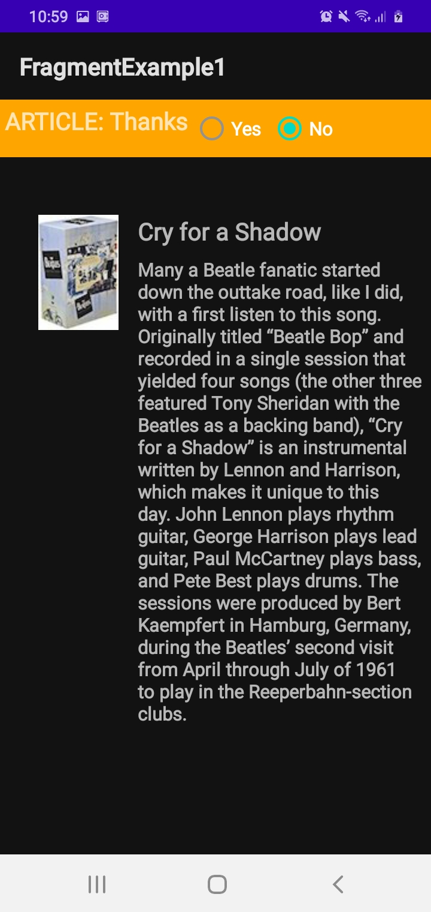
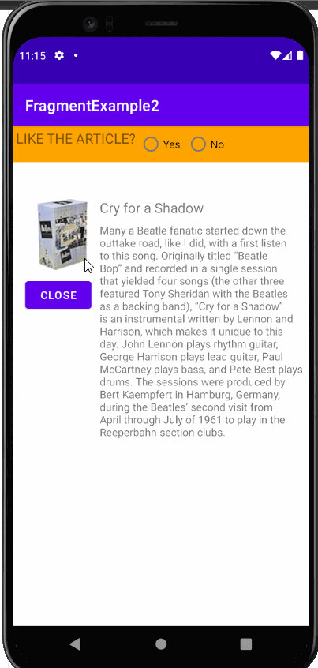

# Lab7-Fragment

## FragmentExample1 Application Overview

- Application Index Potrait

- Application Index Landscape

## FragmentExample1 Application Workings

- Yes Radio Button Potrait

- Yes Radio Button Landscape

- No Radio Button Potrait

- No Radio Button Landscape

## FragmentExample2 Application Overview

- Application Index Potrait with open and close button working

- Application Index Landscape with open and close button working

# FragmentExample1-Challenge

## FragmentExample1-Challenge Application Overview

- Application Index 

## FragmentExample1-Challenge Application Workings

- Yes Radio Button Potrait

- No Radio Button Potrait

# FragmentExample2-Homework

## FragmentExample2-Homework Application Overview

- Application Main Index 

## FragmentExample2-Homework Application Workings

- No Radio Button

- When Next Button is Used

- When Previous Button is Used

